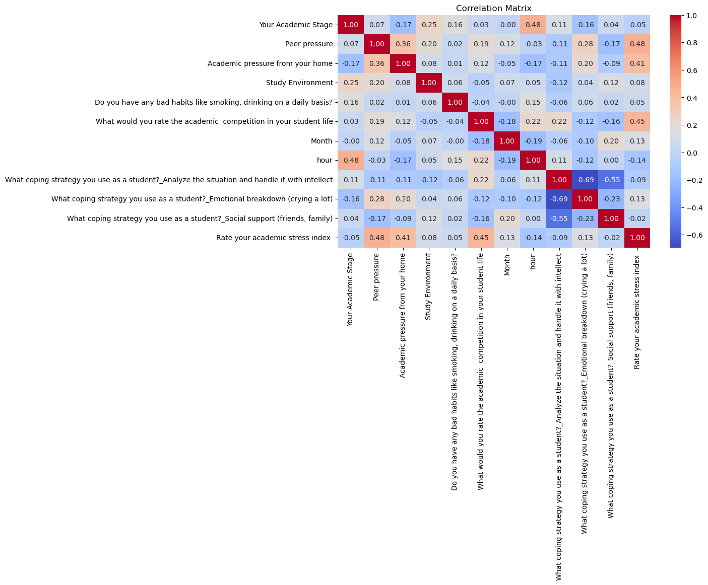

Student Academic Stress Analysis and EDA

OVERVIEW:
This project analyzes survey data to understand the factors influencing academic stress in students. The goal is to perform data cleaning, feature engineering, and exploratory analysis.

Dataset

The dataset contains the academic stress report of students and the factors that influence them. The data was sourced from
(https://www.kaggle.com/code/ayeshaimran123/eda-academic-stress-level/notebook)

Overview:
The dataset is a survey of students containing information on academic pressures, study habits, personal environment, and self-reported stress levels.

Features:
Timestamp	Your Academic Stage	Peer pressure	Academic pressure from your home	Study Environment	What coping strategy you use as a student?	Do you have any bad habits like smoking, drinking on a daily basis?	What would you rate the academic competition in your student life	Rate your academic stress index

PROJECT WORKFLOW:

Data Cleaning: Handled missing values to ensure data quality.

Feature Engineering: Created new features from the data, including extracting the 'Hour' and 'Month' from timestamps and converting categorical text columns into a numerical format using One-Hot and Label Encoding.

Exploratory Data Analysis (EDA): Generated a correlation matrix and heatmap to investigate the relationships between features and the academic stress index.

KEY INSIGHTS FROM ANALYSIS:
The exploratory data analysis, particularly the correlation matrix, revealed that most features have a weak linear correlation with the 'academic stress index'.

TECHNOLOGIES USED:

Python

pandas

scikit-learn

seaborn

matplotlib